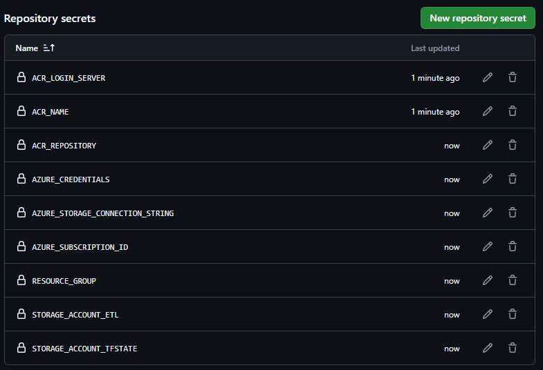

# Pipeline de Dados Automatizado com DevOps

## Integração na Prática

Imagine um cenário onde:
- Um engenheiro de dados desenvolve um pipeline ETL em Python.
- O código é versionado no GitHub.
- GitHub Actions executa testes automatizados e faz deploy em containers Docker.
- Terraform provisiona o ambiente em nuvem.
- Executa o container (ACI) que roda o ETL e grava no Storage
- Power BI consome os dados do storage e apresenta visualizações para o time de negócios.
- O Cientista de Dados utiliza os dados do storage para trabalhar com algoritmos de Machine Learning

Esse fluxo automatizado é o `DevOps aplicado à Egenharia de Dados` - promovendo agilidade, confiabilidade e escalabilidade.


## Cenário: Pipeline de Dados Automatizado com DevOps

Objetivo:
Criar um pipeline que:
1. 	Ingesta dados de uma API pública.
2. 	Processa e limpa os dados com Python.
3. 	Usa Docker para empacotar os serviços.
4. 	Automatiza tudo com GitHub Actions.
5. 	Provisiona infraestrutura com Terraform.
6. 	Tarefa agendada para executar o container (ACI)
7. 	Armazena em um banco de dados.
8. 	Gera visualizações no Power BI.

Fluxo Final da Esteira
1. 	Commit no GitHub → dispara pipeline.
2. 	Scan → garante segurança.
3. 	Terraform → garante infra provisionada.
4. 	Docker build/push → imagem no ACR.
5. 	Executar container (ACI) → roda ETL e grava no Storage.
6. 	Power BI → consome dados do Storage.

### Requisitos
1. Conta configurada no Github
2. Conta configurada na Azure
3. Azure CLI configurado no terminal
4. Terraform configurado no terminal
5. (Opcional) Ambiente virtual de desenvolvimento, por exemplo, [Anaconda](https://www.anaconda.com/download) que será utilizado aqui.
6. Python versão >= 3.13
7. Docker

### Estrutura de Diretórios
- Infraestrutura
    - `terraform/infra`: Provisiona recursos base como Resource Group, Storage Accounts e Containers.
    - `terraform/ppipeline`: Cria recursos de aplicação como o Azure Container Registry (ACR).

- Automação CI/CD Github Actions - Contém os workflows YAML para:
    - `terraform.yml`: Provisionamento com Terraform
    - `ci-cd.yml`: Pipeline principal com scan do código, imagem do container, build e push.
    - `executa-etl.yml`: Execução do container ETL e armazena em um Blob (Agendado)
    - `destroy-infra.yml`: Destruição da infraestrutura

- Container ETL
    - `Dockerfile`:  Define a imagem do container
    - `etl_weather.py`: Script principal de ETL
    - `requirements.txt`:  Dependências Python
    - `.dockerignore`: Arquivos ignorados na build

## Containerização do ETL com Docker
Por quê utilizar containers e não apenas o script?

A escolha entre executar apenas o script ou usar um contêiner Docker agendado depende de alguns fatores como escalabilidade, portabilidade, segurança e ambiente de execução.

### Opção 1: Executar apenas o script (.py)
Vantagens:
- Mais leve e direto.
- Fácil de testar e depurar localmente.
- Ideal para ambientes já configurados (como GitHub Actions com Python).

Limitações:
- Depende do ambiente estar corretamente configurado (versão do Python, pacotes, variáveis).
- Menos portável entre servidores ou nuvens diferentes.
- Pode gerar inconsistências se rodar em máquinas diferentes.

### Opção 2: Executar via contêiner Docker
Vantagens:
- Ambiente 100% controlado e replicável.
- Ideal para agendamentos em nuvem, CI/CD, ou servidores com Docker.
- Pode incluir dependências extras (drivers, SDKs, etc.) sem afetar o host.
- Pronto para escalar ou migrar para Azure Container Instances, Kubernetes, etc.

Limitações:
- Requer tempo inicial para configurar e testar.
- Precisa de suporte a Docker no ambiente de execução (GitHub Actions, Azure, etc.).

Como já está sendo usado o GitHub Actions e pretendemos enviar os dados para um banco na Azure, o contêiner Docker é a melhor escolha. Ele garante que:
- O script rode sempre no mesmo ambiente.
- As dependências estejam empacotadas.
- Você possa escalar ou migrar para Azure Container Instances ou Azure Functions no futuro.

### (Opcional) - Configurar Ambiente virtual com Anaconda e executar localmente, apenas como entendimento.
Para criar o ambiente, abra o terminal `cmd` no mesmo diretório do projeto e execute:
```bash
conda create -n weather-etl python=3.13
```
Ativar o ambiente
```bash
conda activate weather-etl
```
Após ativar o ambiente, certifique-se que aparecerá algo assim:
```bash
(weather-etl) C:\Projetos\azure-weather-etl>
```
No `VSCode`, além de ativar o ambiente, certifique-se que ao abrir o arquivo `etl_weather.py` estará ativo o ambiente criado na barra inferior com o mesmo nome. Talvez seja preciso sair da IDE e abrir o projeto novamente. Provavelmente, aparecendo ou não, terá que reativar o ambiente.

Instalar dependências `DENTRO DO AMBIENTE`
```bash
pip install -r requirements.txt
```

Essa primeira etapa consiste em extrair dados de clima de uma cidade específica a partir duas APIs públicas através do script em python chamado `etl_weather.py`. A consulta retorna a temperatura dentro de cada hora daquele dia, cria o diretório `data` caso não exista e salva em um arquivo `.csv` com essas informações. 

Como funciona:
1. Entre com o nome da cidade desejada na variável `cidade`
2. Entre com a quuantidade de dias para a previsão na variável `dias`
3. execute o comando:
```bash
python etl_weather.py
```

## Etapa 1 - Infraestrutura na Azure - Terraform + Github Actions

Definir variáveis locais `através do terminal`, garantindo que seus valores sejam idênticos aos dos arquivos `variables.tf`, `backend-config.hcl` e `remote-state.tf` no diretório terraform. 
```bash
RESOURCE_GROUP="rg-weather-etl"
STORAGE_ACCOUNT_TFSTATE="tfstateweatheretlmmrj" # Azure Storage deve possuir um nome global único 
CONTAINER_TFSTATE="tfstate"
STORAGE_ACCOUNT_ETL="dadosweatheretlmmrj" # Azure Storage deve possuir um nome global único 
CONTAINER_ETL="etldata" # valor utilizado no arquivo etl_weather.py na variável container_name, linha 73
ACR_NAME="acrweatheretl" 
ACR_REPOSITORY="weather-etl" # refere-se ao nome da imagem do container/repositório sem tags dentro do ACR
LOCATION="eastus"
```

### Pré-requisito para iniciar o workflow - Provisionar Infraestrutura CLI

Antes de executar o pipeline de provisionamento via GitHub Actions, é necessário criar manualmente os recursos que servirão como backend remoto do Terraform: o `Resource Group`, o `Storage Account` e o `container` para o estado `tfstate`. Essa etapa é essencial porque o Terraform precisa de um backend funcional para armazenar e gerenciar o estado da infraestrutura. Como esses recursos são criados fora do controle do Terraform, eles devem ser importados para o estado usando terraform import no pipeline. Isso garante que o Terraform reconheça esses recursos e não tente recriá-los. Após essa preparação, o restante da infraestrutura pode ser provisionado automaticamente via GitHub Actions.

Criar Resource Group
```bash
az group create \
--name $RESOURCE_GROUP \
--location $LOCATION
```

Criar Storage Account tfstate
```bash
az storage account create \
--name $STORAGE_ACCOUNT_TFSTATE \
--resource-group $RESOURCE_GROUP \
--location $LOCATION \
--sku Standard_LRS \
--kind StorageV2
```

Criar o Container para o tfstate
```bash
az storage container create \
--name $CONTAINER_TFSTATE \
--account-name $STORAGE_ACCOUNT_TFSTATE
```
Criar Storage Account para os dados do ETL
```bash
az storage account create \
--name $STORAGE_ACCOUNT_ETL \
--resource-group $RESOURCE_GROUP \
--location $LOCATION \
--sku Standard_LRS
```

Criar Container para os dados do ETL
```bash
az storage container create \
--name $CONTAINER_ETL \
--account-name $STORAGE_ACCOUNT_ETL
```


### Secrets GitHub - será obtida através da saída dos comandos:

Como serão utilizados workflows em arquivos separados a forma mais simples de capturar os valores é em forma de secrets.

 

- RESOURCE_GROUP

- ACR_NAME

- ACR_REPOSITORY

- STORAGE_ACCOUNT_TFSTATE 

- STORAGE_ACCOUNT_ETL

- AZURE_SUBSCRIPTION_ID
```bash
AZURE_SUBSCRIPTION_ID=$(az account show --query id --output tsv)

echo $AZURE_SUBSCRIPTION_ID
```
- AZURE_CREDENTIALS
```bash
az ad sp create-for-rbac \
--name "sp-weather-etl" \
--role contributor \
--scopes /subscriptions/$AZURE_SUBSCRIPTION_ID \
--sdk-auth
```
---
As credenciais abaixo serão implementadas no Secrets após o provisionamento da infraestrutura.

- AZURE_STORAGE_CONNECTION_STRING
```bash
AZURE_STORAGE_CONNECTION_STRING=$(az storage account show-connection-string \
--resource-group $RESOURCE_GROUP \
--name $STORAGE_ACCOUNT_ETL \
--query connectionString \
-o tsv)

echo $AZURE_STORAGE_CONNECTION_STRING
```
- ACR_LOGIN_SERVER
```bash
ACR_LOGIN_SERVER=$(az acr show \
--name $ACR_NAME \
--query loginServer \
--output tsv)

echo $ACR_LOGIN_SERVER
```


### Validações do terraform e provisionamento inicial do backend
Antes de enviar os códigos do terraform para o pipeline, acesse cada diretório `.\terraform\infra` e `.\terraform\pipeline` e execute os comanddos:
```bash
terraform init -backend-config="backend-config.hcl"
terraform fmt
terraform validate
terraform plan -out=tfplan -var="subscription_id=$AZURE_SUBSCRIPTION_ID"
```
- `Observação`: dentro do diretório `terraform\pipeline` ao executar o terraform plan pode gerar um erro de output referente ao `nome` do resource group, onde para validação local deve ser substituido no `main.tf` pelo nome declarado na variável `$ACR_NAME` apenas para validar plano, pois ele aguarda o output gerado durante o provisionamento do pipeline do job `infra`.

---
- Verificar o estado de lock manualmente
```bash
az storage blob show \
--container-name $CONTAINER_TFSTATE \
--name infra.tfstate \
--account-name $STORAGE_ACCOUNT_TFSTATE \
--query "properties.lease" \
--output json
```
Se o lease estiver ativo, você pode tentar removê-lo manualmente com:
```bash
az storage blob lease break \
--container-name $CONTAINER_TFSTATE \
--blob-name infra.tfstate \
--account-name $STORAGE_ACCOUNT_TFSTATE
```
### Executar o container localmente
Aqui estão os passos exatos para executar seu contêiner localmente:

1. Faça login no seu ACR:
Abra seu terminal e execute o comando:
```bash
az acr login --name $ACR_NAME
```
2. Encontre a Tag da Imagem:
Para baixar a imagem, você precisa da tag mais recente. Você pode encontrá-la no Portal Azure ou executar o comando abaixo para obter a última tag enviada:
```bash
az acr repository show-tags \
--name $ACR_NAME \
--repository $ACR_REPOSITORY \
--orderby time_desc \
--top 1 \
--output tsv
```
3. Baixe a Imagem:
```bash
docker pull $ACR_LOGIN_SERVER/$ACR_REPOSITORY:latest
```
4. Execute o Contêiner:
```bash 
docker run --rm -e AZURE_STORAGE_CONNECTION_STRING=$AZURE_STORAGE_CONNECTION_STRING $ACR_LOGIN_SERVER/$ACR_REPOSITORY:latest
```

## Etapa 2 - Conectar Power BI ao Blob Storage

Passo a passo no Power BI Desktop

1. Página Inicial > Obter dados de outras fontes
2. Conecte ao Blob Storage
- Vá em Home > Obter Dados > Azure > Armazenamento de Blobs do Azure
- Insira o nome da conta. Também pode ser recuperado acessando o storage sua conta, abrindo um dos arquivos e copiando o link, ou:
```bash
echo https://$STORAGE_ACCOUNT_ETL.blob.core.windows.net/$CONTAINER_ETL
```
- Escolha o método de autenticação (chave, SAS ou Azure AD)
```bash
az storage account keys list \
--account-name $STORAGE_ACCOUNT_ETL \
--resource-group $RESOURCE_GROUP \
--query "[0].value" \
--output tsv
```
3. Liste todos os arquivos
- O Power BI vai mostrar uma tabela com os arquivos do container
- Clique em Transformar dados
4. Irá trazer todos os arquivos no container. Clique em `Binary` para carregar a fonte que deseja
- Abrirá a janela do Power Query para fazer o tratamento das colunas e linhas
- Renomeie o nome da Tabela
- Cada modificação fica salva no campo `Etapas Aplicadas` então no próximo arquivo basta clicar em `Atualizar Visualização` na aba `Página Inicial`
5. Para finalizar a edição clique em `Fechar e aplicar`
6. Etapa de Criação do painel de visualização
